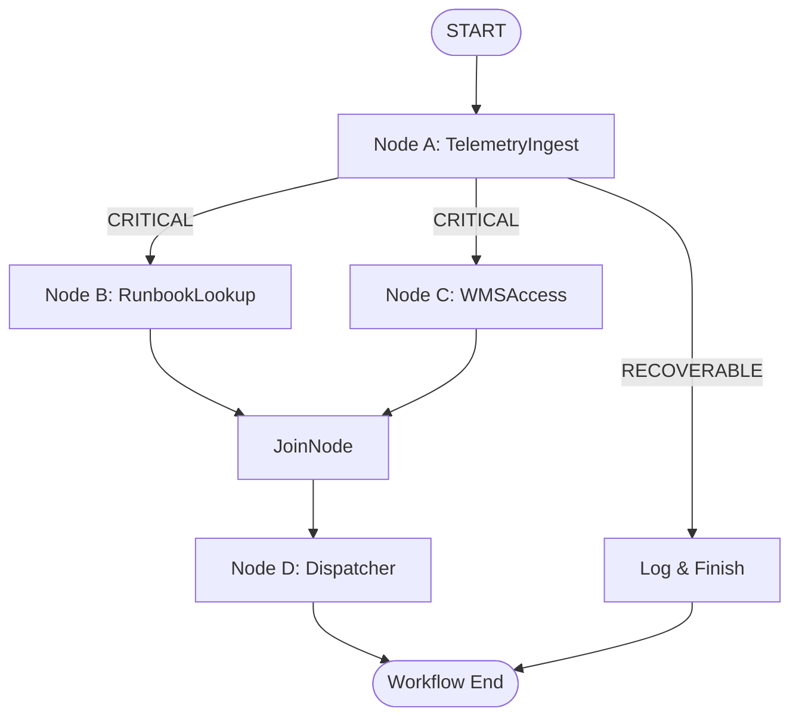

# Design Spec: Stackbox Conveyor Orchestrator (stackbox-conveyor-orchestrator)

This document details the multi-agent warehouse orchestration system designed to handle critical conveyor belt malfunctions deterministically. The orchestrator uses the graph-based Workflow API of the Agent Development Kit (ADK) 2.0.

---

## 1. System Topology & Flow Diagram

The orchestrator operates as a directed acyclic graph (DAG) where nodes represent isolated functional steps or agent decisions, and edges dictate the execution path based on data payloads.

---

## 2. Graph Nodes Specifications

### Node A: TelemetryIngest
*   **Type**: `FunctionNode`
*   **Input**: `types.Content` (Raw log string from standard input)
*   **Behavior**: Extracts key attributes (`conveyor_id`, `error_code`, `sku`, `status`) from structured or semi-structured telemetry strings.
*   **Output**: `Event(output=TelemetryData, route=status)`
*   **Routing Logic**:
    *   If `status == "CRITICAL"`, routes to `RunbookLookup` and `WMSAccess` in parallel.
    *   If `status == "RECOVERABLE"`, routes to `LogRecoverable`.

### Node B: RunbookLookup
*   **Type**: `FunctionNode`
*   **Input**: `TelemetryData` (from `TelemetryIngest` output)
*   **Behavior**: Executes a simulated Vector Search query `query_runbooks(error_code)` to pull high-context mechanical repair instructions.
*   **Output**: `Event(output=RunbookOutput)`

### Node C: WMSAccess
*   **Type**: `FunctionNode`
*   **Input**: `TelemetryData` (from `TelemetryIngest` output)
*   **Behavior**: Invokes a simulated MCP Server tool `check_wms_stock(sku)` to find if stock is currently blocked or available.
*   **Output**: `Event(output=WMSOutput)`

### Node D: Dispatcher
*   **Type**: `LlmAgent`
*   **Input**: `dict` (Aggregated inputs merged by `JoinNode`)
*   **Behavior**: 
    1. Evaluates WMS inventory availability and the corresponding runbook repair path.
    2. If the SKU status is `BLOCKED`, dynamically calls `dispatch_agv(aisle, task)` to execute a physical picking bypass.
    3. Synthesizes an authoritative engineering summary report detailing the telemetry event, runbook actions, and the bypass status.
*   **Tools**: `dispatch_agv`
*   **Output**: `types.Content` (Final user-facing report)

### LogRecoverable (Fallback Node)
*   **Type**: `FunctionNode`
*   **Input**: `TelemetryData`
*   **Behavior**: Commits a non-critical entry to the operational log and completes the workflow.
*   **Output**: `Event(output=LogOutput)`

---

## 3. Tool Definitions

The system utilizes three mock tools to interface with physical and software systems:

### 1. `check_wms_stock` (MCP Server Mock)
*   **Arguments**: `sku: str`
*   **Returns**: `dict` containing SKU status, quantity, and physical warehouse aisle location.

### 2. `query_runbooks` (Vector Search Mock)
*   **Arguments**: `error_code: str`
*   **Returns**: `dict` containing matched instructions and error severity/urgency level.

### 3. `dispatch_agv` (AGV/Picker Bot Dispatch Mock)
*   **Arguments**: `aisle: str`, `task: str`
*   **Returns**: `dict` indicating dispatched status, target aisle, and task instructions.

---

## 4. Error Handling & Jittered Backoff

Each `FunctionNode` interacting with hardware components (`RunbookLookup` and `WMSAccess`) is equipped with a `RetryConfig`:
*   `max_attempts`: `3`
*   `initial_delay`: `1.0` second
*   `backoff_factor`: `2.0` (exponential)
*   `jitter`: `0.5` (mitigates stampede effects on physical controllers)

---

## 5. Security & Governance

### Model Armor Policy
A strict input/output filter configured in `deployment/model_armor_config.yaml` to:
*   Sanitize instructions to prevent prompt injection.
*   Prevent operators from altering motor speeds beyond physical tolerances (e.g. banning keywords like `"override motor speed"` or `"bypass speed ceiling"`).

### SPIFFE Identity
A standard service identifier `spiffe://stackbox.internal/ns/warehouse/sa/conveyor-orchestrator` to enforce mutual TLS and cryptographically verify credentials during AGV dispatch and WMS queries.
